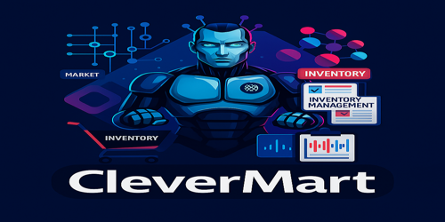

<!--
  CleverMart – README.md
  A modern AI-powered Smart Shop platform built on the Microsoft Power Platform
-->

<h1 align="center">
  🛒 CleverMart
  <br>

  <sub><em>AI-powered Smart-Shop Platform</em></sub>

  
</h1>

<p align="center">
  <a href="https://make.powerapps.com">Power Apps</a> •
  <a href="https://powerautomate.microsoft.com">Power Automate</a> •
  <a href="https://copilotstudio.microsoft.com">Copilot Studio</a> •
  <a href="https://learn.microsoft.com/power-platform">Microsoft Power Platform</a>
</p>

<p align="center">
  
  
  
</p>

---

## ✨ What is CleverMart?

*CleverMart* is a dual-mode shop-management solution:

| Role            | Experience                                                         |
|-----------------|--------------------------------------------------------------------|
| **Business Owner** | Manage products, inventory, vendors, and sales analytics—right from Power Apps |
| **Customer**        | Scan a QR code and chat/voice with an AI assistant to browse items, place orders, and receive invoices |

Behind the scenes, Copilot Studio serves as the **virtual General Manager**, while Power Automate orchestrates orders, invoicing, and stock alerts.

---

## 🎬 Interactive Demo Walkthrough

> 💡 **Complete demo package available**: Download the full demo with all screenshots and materials from [`CleverMart-Demo.zip`](./Demo/demo.zip) 

<div align="center">
  
  ### 🚀 Experience CleverMart in Action
  
  *Take a visual journey through our intelligent retail management platform*

</div>

---

### 🔐 **Screen 1 – Welcome & Authentication**


<div align="left">
  
  
</div>

> *"Welcome to CleverMart, your intelligent companion for managing your smart retail store. Let's begin by logging into the system to access the powerful dashboard."*

**Key Features Shown:**
- 🎨 Modern, intuitive login interface
- 🔐 Multi-role authentication (Owner/Customer)
- 🌟 Brand consistency with CleverMart theming

---

### 📊 **Screen 2 – Command Center Dashboard**
**Screenshot Source:** `demo-screenshots/02-dashboard-overview.png`

<div align="left">
  
  
  
</div>

> *"Once logged in, we land on the main dashboard. Here, you can add a new product, generate daily reports, and instantly view real-time sales, total orders, and any low stock alerts. The dashboard is simple, clean, and informative—ideal for shop owners on the go."*

**Dashboard Highlights:**
- 📊 **Live Sales Metrics**: Real-time revenue tracking
- 🛍️ **Order Statistics**: Total orders & conversion rates  
- ⚠️ **Smart Alerts**: Automated low-stock notifications
- ➕ **Quick Add**: One-click product addition

---

### ➕ **Screen 3 – Smart Product Management**
**Screenshot Source:** `demo-screenshots/03-add-product.png`

<div align="left">
  
  
  
</div>

> *"Adding a product is straightforward. Just click on 'New' and enter the product details like name, category, and vendor. Our categories cover everything from beverages and dairy to snacks and produce."*

**Product Categories Supported:**
- 🥤 **Beverages** | 🥛 **Dairy Products** | 🍿 **Snacks & Treats**
- 🥕 **Fresh Produce** | 🍞 **Bakery Items** | 🧴 **Personal Care**

---

### 📈 **Screen 4 – Daily Performance Insights**
**Screenshot Source:** `demo-screenshots/04-daily-report.png`

<div align="left">
  
  
  
</div>

> *"Our daily report feature helps you stay on top of performance. With one click, you can see how many orders were placed and the total revenue. The app also highlights products that are running low on stock."*

**Analytics at a Glance:**
- 💰 **Revenue Tracking**: Daily, weekly, monthly views
- 📦 **Order Volume**: Completed vs. pending orders
- ⚠️ **Inventory Alerts**: Proactive stock management
- 📊 **Trend Analysis**: Performance pattern recognition

---

### 👥 **Screen 5 – Customer Intelligence Hub**
**Screenshot Source:** `demo-screenshots/05-customer-profiles.png`

<div align="left">
  
  
  
</div>

> *"We also offer personalized customer insights. You can track preferred languages, contact info, purchase history, and activity levels. This allows you to engage with your loyal customers more effectively."*

**Customer Insights Include:**
- 🌍 **Language Preferences**: Multi-language support
- 📱 **Contact Management**: Integrated communication
- 🛒 **Shopping Patterns**: Behavioral analytics
- ⭐ **Loyalty Metrics**: Engagement scoring

---

### 🏷️ **Screen 6 – Intelligent Inventory Control**
**Screenshot Source:** `demo-screenshots/06-product-insights.png`

<div align="left">
  
  
  
</div>

> *"Here's a product detail view. You can check the current stock, natural stock capacity, and system-generated alerts for low inventory. This helps store managers make smarter restocking decisions."*

**Inventory Intelligence:**
- 📊 **Current Stock Levels**: Real-time quantity tracking  
- 🔄 **Optimal Capacity**: AI-recommended stock levels
- 🚨 **Smart Alerts**: Automated reorder notifications
- 📈 **Demand Forecasting**: Predictive restocking

---

### 💰 **Screen 7 – Financial Command Center**
**Screenshot Source:** `demo-screenshots/07-finance-overview.png`

<div align="left">
  
  
  
</div>

> *"Lastly, we have the finance overview. It summarizes total revenue, average order value, and order stats for the month and year. It's perfect for gaining financial clarity at a glance."*

**Financial Dashboard Features:**
- 💵 **Total Revenue**: Monthly & yearly summaries
- 🛒 **Average Order Value**: Customer spending patterns  
- 📊 **Order Statistics**: Volume and conversion metrics
- 📈 **Growth Trends**: Performance trajectory analysis

---

<div align="center">

### 🎯 **Ready to Get Started?**


**Download the complete demo package**: [`CleverMart-Demo.zip`](./CleverMart-Demo.zip)  
*Includes all screenshots, sample data, and deployment guides*

</div>

---

## 🏗 Architecture

```text
Power Apps (Canvas)    SharePoint Lists ─ Products / Orders / Vendors / Customers
        │
        ├─ Power Automate flows  (order-to-invoice, stock alerts, QR generation)
        │
        └─ Copilot Studio agent "CleverMart GM" (chat / voice)
                 │
                 └─ Azure Cognitive Services  (Speech, TTS)
```

Data model: see `/solution/CleverMart_DataModel.drawio`.

## 🚀 Getting Started

### 1. Prerequisites
- Power Apps licence with AI Builder credits
- Environment roles: Environment Maker + AI Builder User  
- SharePoint site (or Dataverse) for backend lists

### 2. Setup Steps
```shell
# 1. Import the managed solution (Settings → Solutions → Import)
# 2. Configure environment variables (SharePoint URLs, list IDs)
# 3. Run the 'Provision Lists' flow to create demo data
# 4. Share the Canvas app with users (Owner and Customer roles)
# 5. Publish Copilot Studio agent and test chat/voice
```

See `docs/deployment-guide.md` for a full walkthrough.

## 🧩 Tech Stack

| Layer | Tech |
|-------|------|
| **Frontend** | Power Apps Canvas (Tablet) |
| **Automation** | Power Automate (cloud flows) |
| **AI** | Copilot Studio (Power Virtual Agents) + Azure Speech |
| **Data** | SharePoint Lists (Products, Orders, Inventory, etc.) |
| **Analytics** | Power BI Embedded |

## 🙌 Contributing

1. Fork the repo & create your branch: `git checkout -b feature/awesome`
2. Commit your changes: `git commit -m "Add awesome feature"`
3. Push and open a Pull Request

We follow Conventional Commits and run solution checker before PR approval.

## ❤️ Acknowledgements

- Microsoft Power Platform community
- Open-source icon libraries (Fluent UI, Hero Icons)  
- Inspiration from retail analytics best practices

## Need help?
• [Open an issue](../../issues) • ping @YourName in discussions • or drop us a message on <your Slack/Discord>
